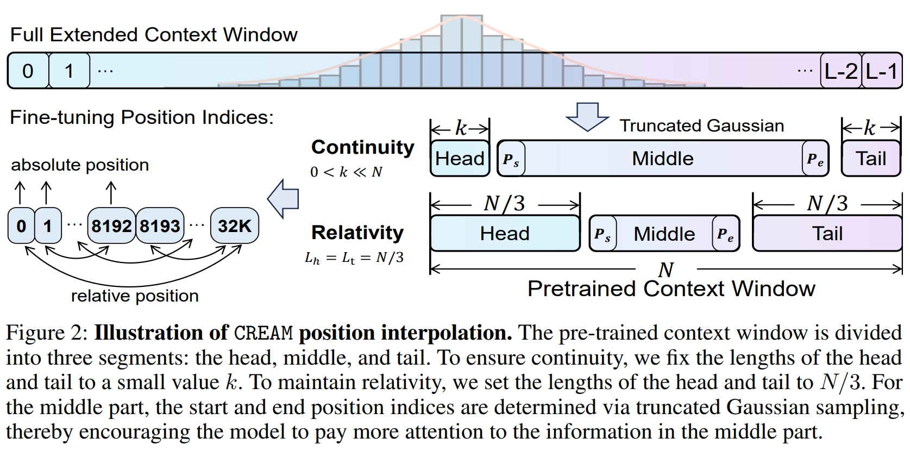
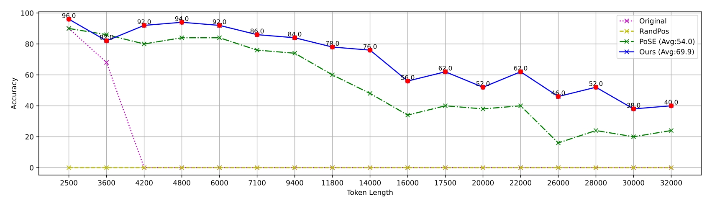
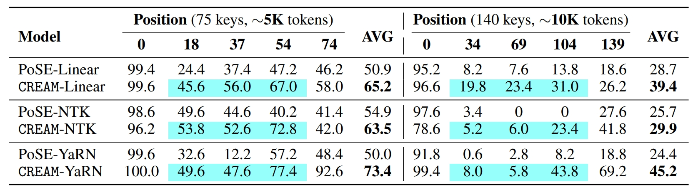
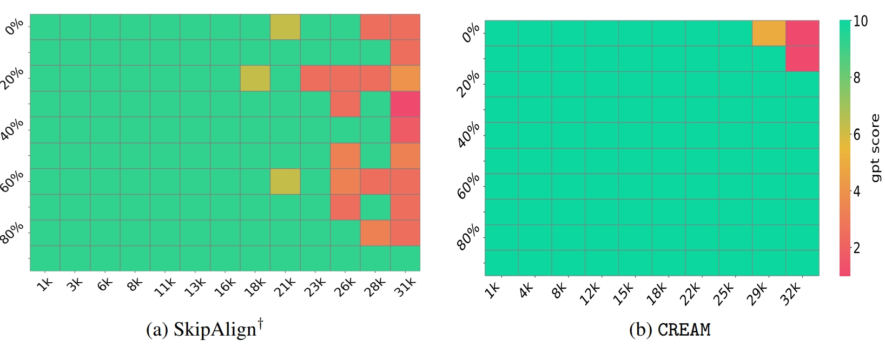
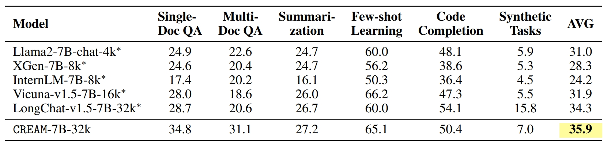
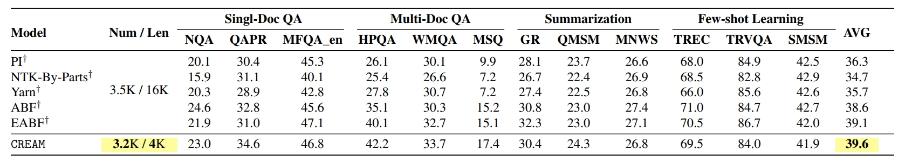

<div align="center">

# Never Miss A Beat: An Efficient Recipe for Context Window Extension of Large Language Models with Consistent “Middle” Enhancement

<a href="https://pytorch.org/get-started/locally/"></a>
<a href="https://huggingface.co/docs/transformers/index/"></a>

<!-- [](https://arxiv.org/abs/2402.16050) -->

<!-- [](https://xxx) -->

</div>

## Updates

<!-- - (2024.02.27) Paper Release, check it on [Arxiv](https://arxiv.org/pdf/2402.16050.pdf).  -->
- (2024.05.24) Initial Release

## Overview

we propose **C**ontinuity-**R**elativity ind**E**xing with g**A**ussian **M**iddle (CREAM), which interpolates positional encodings by manipulating position indices. 

Apart from being simple, CREAM is training-efficient: it only requires fine-tuning at the pre-trained context window (e.g., Llama 2-4K) and can extend LLMs to a much longer target context length (e.g., 256K). 

To ensure that the model focuses more on the information in the middle, we introduce a truncated Gaussian to encourage sampling from the middle part of the context during fine-tuning, thus alleviating the “Lost-in-the-Middle” problem faced by long-context LLMs. 

Experimental results show that CREAM successfully extends LLMs to the target length for both Base and Chat versions of Llama2-7B with “Never Miss A Beat”.



## Installation

```bash
# clone project
git clone git@github.com:wutong4012/CREAM.git
cd CREAM

# create conda environment
conda create -n CREAM
conda activate CREAM

# install requirements
pip install -r requirements.txt

```

## Data Preparation

You can download all the finetune data and evaluation data from [Video-LLaVA/DATA]()

## How to run

*Our training framework offers tailored scripts to meet the diverse needs of researchers.*

Train model

```bash
bash scripts/run_CREAM.sh 8 linear llama2 5946 CREAM

bash scripts/run_CREAM_chat.sh 8 linear llama2_chat 5946 CREAM
```

Evaluate model

```bash
bash scripts/eval_longchat_lines.sh 8 linear llama2 CREAM 1000


bash scripts/eval_lost_in_the_middle.sh 8 linear llama2 CREAM 1000


bash scripts/eval_needle.sh 8 linear llama2_chat CREAM 100


bash scripts/eval_longbench.sh 8 linear llama2_chat CREAM 100


bash scripts/eval_ppl.sh 8 linear llama2 CREAM 1000


bash scripts/eval_long_ppl.sh 64 linear llama2 CREAM 1000
```

## Evaluation Results

*LongChat-Lines*



*Lost in the Middle*



*Needle in a Haystack*



*LongBench*




## Acknowledgement

Data / Code: 
- [PoSE](https://github.com/dwzhu-pku/PoSE)
- [LongChat-Lines](https://github.com/abacusai/Long-Context/tree/main/python/eval/longeval) 
- [Lost in the Middle](https://github.com/nelson-liu/lost-in-the-middle)
- [Needle in a Haystack](https://github.com/gkamradt/LLMTest_NeedleInAHaystack)
- [LongBench](https://github.com/THUDM/LongBench)

## Citation

```

```